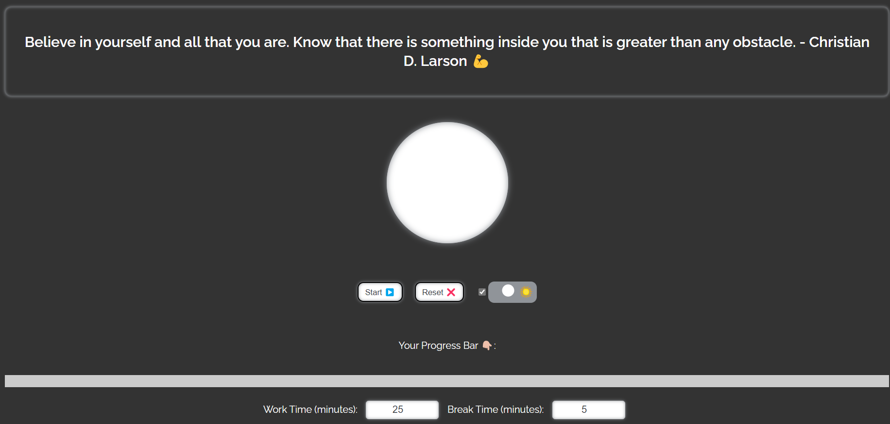

# Pomodoro Timer 🕰️

A simple and minimalistic pomodoro timer web application that helps to boost productivity by using the pomodoro technique.

## Functionalities ⚙️

- Set custom work and break times
- Display a progress bar to show how much time is left in current session
- Sound notifications to indicate the start and end of a session
- Dark mode toggle switch to switch between light and dark mode
- Random motivational quote displayed at the start of every session
- Automatically change quote after every 10 sec
- Fully responsive design for mobile and tablet devices

## Live Demo 💻

https://anmol2059.github.io/pomodoro

## Screenshots 📷

## How to use 🛠️

1. Open the above link in your browser.
2. Set your preferred work and break times.
3. Press the start button to begin the timer.
4. Press the stop button to pause the timer.
5. Press the reset button to reset the timer.
6. Use the dark mode toggle switch to switch between light and dark mode.
7. A motivational quote will be displayed at the start of every session.
8. Automatically change quote after every 10 sec

## Technologies used 🔨

- HTML
- CSS
- JavaScript
- Google Fonts

## Contribute 🤝

If you want to contribute to this project, please fork this repository and make the changes in your fork. Then, open a pull request to this repository with your changes.
